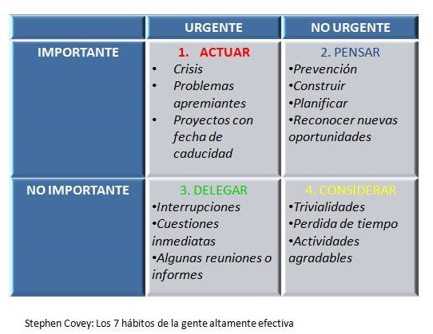

# Curso de creatividad

## ¿Por qué crear?

### De creativo a creador

Las ideas frustadas viven en todas las cabezas porque precisamente crearlas es el verdadero reto.
Para ser un mejor creador, tener mejores preguntas es mejor que tener todas las respuestas.
Crear es como tener un jardín que hay que cuidar todos los días.

### Si no estás creando, estás destruyendo

"The opposite of war isn't peace... is creation"
La guerra es destrucción.
La paz es tranquilidad y esto no es realmente lo contrario a la guerra.
El antonimo de la guerra es la creación.

El mundo se puede devidir en 2 tipos de personas:

- Los que consumen
- Los que crean

Todos pertenecemos al primer grupo. Pero no todos creamos. Por eso hay sobre-consumo. Y si solo consumes solo estás destruyendo, porque le estás quitando al mundo más de lo que le estás dejando.
Todos tenemos el potencial de crear.
El gran secreto de la gente que crea, no es que sean creativos, sino que se saben creativos.
Cambiar el mundo NO solo está reservado para los genios. Si tienes una idea y una computadora con conexión a internet, tienes todo lo necesario para dejar este mundo mejor que como lo encontraste.

No busques la paz, busca la creación, porque si no estás creando, estás destruyendo.

### El mito de la creatividad

Tener creatividad es una forma alternativa de pensar. Es abrir una puerta sin girar la manija. Encontrar nuevas formas de contar una historia. Pasar de A a C sin pasar por B.
Una buena idea ≠ Una idea creativa
La creatividad es conectar una idea a nuestra mente para solucionar problemas.
Los problemas son el alimento favorito de la creatividad.
Por naturaleza, el humano busca tener certeza sobre las cosas, pero la creatividad funciona con preguntas.
Tener todas las preguntas resueltas mataría a la creatividad.
El conocimiento es la creatividad graduada.
No basta con tener creatividad, porque esta es solo el medio, no el fin. Es el primer paso para crear.

#### Reto: mensaje para tener más propinas siendo barista

"Tu propina mejorará tu café favorito"

### No tengas ideas

"Las ideas no sirven si no se hacen".
Es diferente solo tener una idea de realmente crearla.

El solamente tener una idea te pone en *empate* con cualquier otro ser humano en el mundo.

Las ideas no son para tenerlas, son para trabajarlas y hacerlas realidad.

Internet llegó al mundo para ser tomado por los creadores.

**Deja de creer que con tener una idea es suficiente.**

¿Cómo sabemos si una idea es buena o es mala? La mejor manera de saberlo es haciéndolas.
Pero no siempre es lo más óptimo. Lo que debes hacer es autocuestionarte.

Modelo para cuestionarte:

- Hazte preguntas, ¿conecta tu idea el mundo físico con el mundo digital?
- No es lo mismo "No se puede hacer" a "Es muy caro"
- Cuando tienes una idea que cabe en una foto, la pregunta a surgir es "¿qué más puede ser esto?"
- Piensa en si tu idea es lo suficientemente grande para que la tomen muchas personas.
- Si tu idea se puede convertir en un negocio, probablemente es una buena idea.
- ¿Cuenta tu idea una gran historia? Storytelling.

#### Reto de contestar las preguntas

¿Conecta mi idea con el mundo digital?: Al ser una página de internet sobre libros que recomiendo y tienen enlaces de Amazon, sí.
¿Se puede hacer, es muy cara? Sí, no.
¿Es lo suficientemente grande? Creo que solo para personas que disfrutan leer.
¿Cuenta una gran historia? "Yo era un chico como ustedes, al que no le gustaba leer porque se le hacía aburrido. Hasta que se motivó porque vio que las personas existosas leen muchos libros. Hoy llevo 82 libros leídos y hablo sobre ellos para fomentar la lectura en Latinoamérica".

### Entrena tu talento

Ideas sin manos y manos sin ideas son ambas inútiles. No sirve de nada tu talento si no lo utilizas. La disciplina es el siguiente paso del talento.

### ¿Cómo ser original?

Aprende a observar las cosas correctas. Encuentra una voz propia usándola y jugando con ella. La verdadera originalidad se encuentra en hacer la mezcla correcta. Júntate con gente talentosa, gente que no sabe lo que haces y explícales. Júntate con gente que no sabes lo que hace y pídeles que te expliquen. Ródeate de gente que piense distinto de ti.

### Crea para ti

Si no estás haciendo algo que alguien más usaría, nadie lo va a usar. Si no creas algo de lo que te sientas orgulloso, nadie se sentirá orgulloso de ello.
**La necesidad es el antecedente a la creatividad.**
**La inconformidad es el primer paso del cambio, pero también de la mediocridad.**
**Quéjate de las cosas creando mejores cosas.**

#### 5 cosas que no me gustan o que quisiera que mejoraran

### Empieza ya

Nunca existirá un momento perfecto para empezar. Más vale una idea mal ejecutada que una gran idea que se quedó en tu cabeza. A nadie le importa lo que estás haciendo... aún.
Es mejor tener algo imperfecto que sirva a no tener nada.

Recuerda la regla de Pareto. 80/20.

## Get shit done

### No seas sólo un emprendedor

Históricamente la gente más capacidades técnicas tenía menos capacidades sociales, eso obligaba a que esta persona necesitara a un gran vendedor para vender sus ideas.
Ahora eso se ha sustituido por Internet. Tu trabajo habla por ti mismo.
Nunca antes había sido tan fácil crear, al menos el MVP product.
Mínimo debes hacer el MVP de tu idea, es lo que necesitas para empezar.
Al ser un creador sólo necesitas de ti, tu tiempo y tus herramientras para llevar a la vida tu idea. Al menos la versión alfa.
Los inversionistas NO van a salvarte. Tú no necesitas dinero para crear tu idea. Tú sabes que estás listo o lista para levantar inversión cuando puedes con tus propias habilidades construir por lo menos la mínima versión del proyecto. NADIE TE DEBE NADA. TÚ TIENES QUE HACER QUE LO VALGA.
¿Qué se necesita para levantar inversión?

1. Un modelo de negocio escalable: modelos que pueden lograr hyper-growth. ¿Cómo saber que NO es escalable? Cuando necesitas agregar humanos para que crezca.

2. Levanta la mínima cantidad posible. Entre más levantas, más le estás entregando a la compañía.

Habilidades que ya tengo | Habilidades que me gustaría tener
---|---
Saber inglés|Aprender alemán
Programación|Matemáticas
SQL|SQL pero avanzado
Escribir para internet|Copywriting

### Aprender a hablar de tu idea

Si no puedes comunicar tu idea, no podrás venderla. Tienes que enamorar a los demás de tu idea, tanto como tú lo estás.

1. Escribe un párrafo que explique tu idea.
2. Conviertelo en una oración simple. RESUME. Claro y consciso.
3. Prepara un discurso para cuando que alguien te pregunte qué estás haciendo, sepas qué decir.
4. No improvises, sé natural.
5. Construye una personalidad para tu idea.
6. Sal y habla con la gente. Platica tu idea a los desconocidos. Busca algo humano, algo que los conecte.

Encontrar un símil te puede ayudar a explicar mejor tu idea y a hacer que la gente recuerde tu idea.
No tengas miedo a hablar de lo que estás haciendo.

#### Reto de explicar idea

Quiero lograr fomentar la lectura en latinoamérica mostrándole a la gente los beneficios que esta tiene.

### Crea una rutina

El tiempo vale mucho más que el dinero. Sobre todo cuando tienes el compromiso de llevar a cabo un proyecto.
Para crear un proyecto necesitas tiempo y energía (y estos 2 recursos no se pueden pedir por Amazon).
**La mejor forma de ser dueño de tu tiempo y energía es teniendo una rutina.**
*Ser tu propio jefe significa ser tu propio empleado.*
La disciplina es el paso siguiente del talento y también ***es el paso anterior a la libertad.***
La motivación no es suficiente. La disciplina y una rutina harán la diferencia.
Sigue la regla 8/8/8; 8 horas para dormir, 8 para trabajar y 8 para tus tiempos libres. Pero quizás esto no vaya a servirte y tengas que sacrificar ciertas horas para dedicarle más tiempo a otra actividad.
Aprende a priorizar y enfócate en lo IMPORTANTE, no necesariamente en lo urgente.

### Documenta el proceso

El proceso es muchas veces igual o hasta más importante que el resultado. El proceso trae el aprendizaje.
Crear algo relevante toma su tiempo. No compartir tu proceso es desperdiciar la oportunidad de contar tu historia.
Saber el proceso que costó para llegar al resultado, es lo que le da más valor al resultado.
Documenta tu proceso para ti y para otras personas. Te sirve para voltear atrás cuando lo hayas logrado y para generar empatía con la gente que cree en lo que estás haciendo. Tal vez el proceso sea tu proyecto.

#### Reto, documenta cualquier cosa de tu proyecto

### No renuncies (a tu trabajo)

Por más fé que le tengas a tu proyecto, si no está generando el 80% de tu sueldo, no dejes tu trabajo actual.
Manten tu trabajo y dedica tiempo a tu proyecto en las tardes y/o noches.
Si no tienes un trabajo y solamente tienes a tu idea, consigue un trabajo que te dé lo elemental para sobrevivir.
La bestia te hace escoger lo conveniente sobre lo correcto.

> No hago películas para hacer dinero. Hago dinero para hacer películas. - Walt Disney

Manten tu bestia bajo control mientras puedas.
Si eres un estudiante estás en la etapa más privilegiada para ser un creador.
En esta etapa puedes correr más riesgos.

### Haz productos de consumo

Para vivir de crear debes saber vender lo que creas. La diferencia entre un músico y un creador es que el primero toca lo que vende y el segundo vende lo que toca.

Tienes que aprender a monetizar tu idea.
Aprende a hacer atractivo lo que estás creando. No tengas la soberbia de que a la gente le gustará sólo porque es bueno.
Si la gente no compra lo que estás haciendo, es porque probablemente no lo estás haciendo bien.

### Los contactos se crean, no se piden

No se trata tanto de qué haces, sino de *a quién conoces.*
Es la era más fácil de hacer contactos gracias a internet.
Tu mejor networking es tu mejor trabajo.

#### Reto: mandar un tweet a la persona con quien quieres trabajar

## Se vale fracasar

### Fracasar sí es una opción

Así como tienes oportunidades de cambiar el mundo, también puedes fracasar. Equivocarse es buena señal, estamos recorriendo nuevos rumbos que no aparecen dentro del mapa. **El fracaso potencializa la creación** *, pero el miedo al fracaso, la mata.*
Fracasar no es algo bueno, pero es parte del proceso. Es un riesgo que hay que correr.
Tener errores nos prueba lo mucho que nos queda por aprender.
La gente que te quiere no será sincera contigo.
Si no cambias, *el mundo te cambia.*
Si eres el más inteligente del cuarto, estás en el cuarto equivocado.

## Cómo lidiar con el éxito

### Divertirse es cosa seria

Ten en cuenta que comprometerte tanto a tu idea, implica dedicarle gran parte de tu tiempo libre. No te olvides de ti. Divertirse es tan importate como dormir.
A veces te toca ser lluvia y a veces solo te toca ver llover.
No puedes crear cosas nuevas mirando solamente las 4 paredes, sal al mundo real y encontrarás las nuevas ideas.
Alejarte de la pantalla también es buena idea. Haz que divertirte sea una parte de tu rutina.

***Trabajas para vivir, no vives para trabjar***

### ¿Qué hacer después del éxito?

Si todo sale bien, puedes llegar la éxito. Si llegas a este punto, hay 2 cosas importantes a considerar:

1. Analiza qué fue lo que se hizo bien.
2. El éxito también es efímero.

Disfruta un rato tu zona de confort, pero sal de ahí rápidamente.
Haz el camino más fácil para las personas que vienen por detrás.
No solo basta con hacer las cosas mejores, *sino también, mejores cosas.*

*Estar inspirado es bueno, pero inspirar es increíble.*

Todo lo que creas está limitado por lo que sabes, *nunca pares de aprender.*
